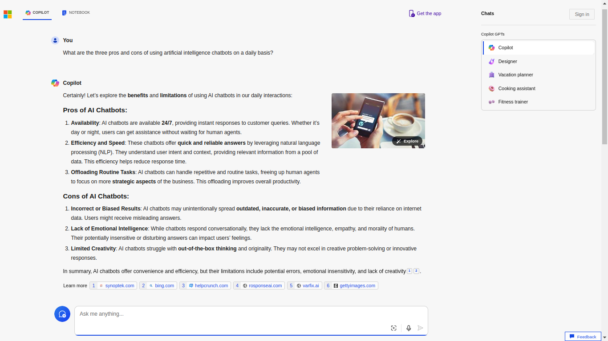
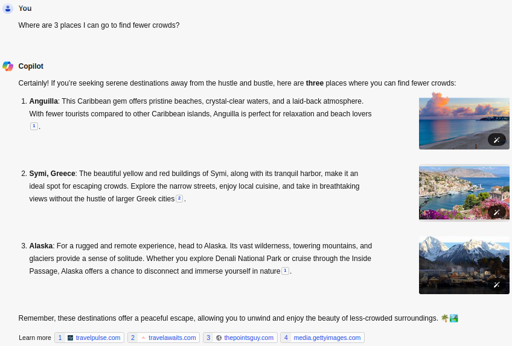
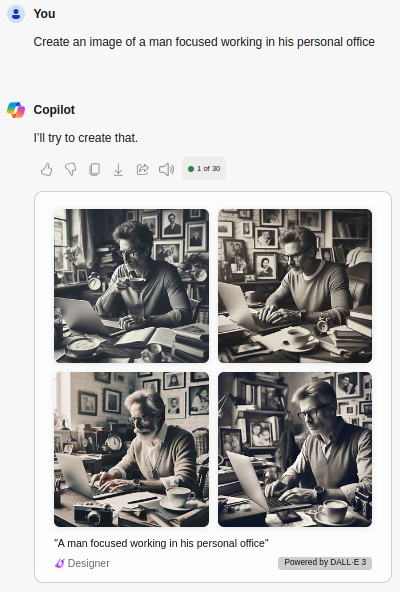
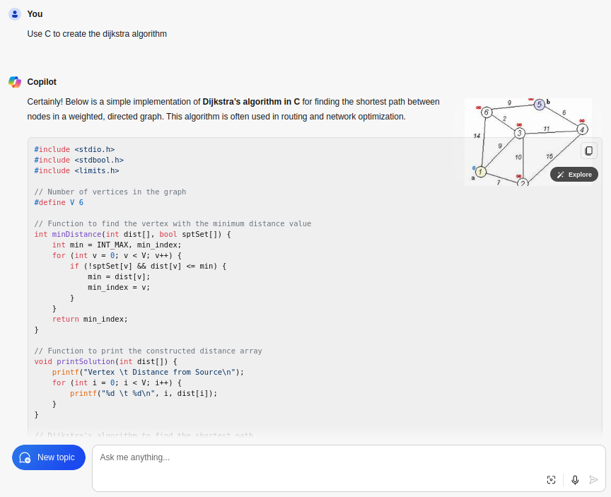

# Resumo IA Generativa com Microsoft Copilot

-green)

-blue)

## Introdução

O objetivo desse laboratório é testar algumas funcionalidades do Microsoft Copilot, IA generativa da Microsoft. Esses procedimentos foram realizados como parte do **Bootcamp Microsoft Azure AI Fundamentals, da DIO**.

**Inteligência Artificial Generativa (IA generativa)** desempenha um papel crucial no cenário tecnológico atual. Essa classe de algoritmos e modelos permite que máquinas criem conteúdo original, extrapolando os limites da programação tradicional. Sua importância reside na capacidade de gerar novas ideias, arte, música, texto e até mesmo imagens realistas. O impacto da IA generativa é vasto, abrangendo áreas como:

1. **Arte e Criatividade**: Artistas e designers utilizam IA generativa para criar obras únicas, explorando novas formas e estilos. Ela inspira a criatividade humana e desafia as convenções artísticas.

2. **Processamento de Linguagem Natural (NLP)**: A geração automática de texto é uma aplicação essencial da IA generativa. Ela pode escrever artigos, resumos, diálogos e até mesmo poesia.

3. **Design e Layout**: Ferramentas de design assistido por IA geram layouts, logotipos e designs gráficos com base em entradas do usuário.

4. **Música e Composição**: A IA generativa cria harmonias, melodias e até mesmo composições completas. Ela colabora com músicos e compositores, oferecendo novas perspectivas criativas.

5. **Jogos e Simulações**: Ela aprimora a experiência de jogos, gerando cenários, personagens e enredos dinâmicos.

A IA generativa está transformando a maneira como interagimos com a tecnologia, impulsionando a inovação e expandindo nossos horizontes criativos.

Nesse laboratório, utilizo algumas funcionalidades da IA generativa para gerar respostas de texto, imagens e código com o Microsoft Copilot.

Esses experimentos foram baseados nos guias da Microsoft Learn. Para informações mais detalhadas, consulte a página [Explore generative AI with Microsoft Copilot](https://microsoftlearning.github.io/mslearn-ai-fundamentals/Instructions/Labs/12-generative-ai.html). Esse readme foi escrito com auxílio de uma IA generativa.

## Procedimento
Para realizar os experimentos aquí mostrados basta acessar o [Microsoft Copilot](https://copilot.microsoft.com), realizar o *login* com uma conta Microsoft e começar a utilizar o *prompt*.

O primeiro teste foi pedir à IA que gerasse 3 prós e contras sobre o uso de IAs generativas diariamente. As Inteligências Artificiais Generativas (IAs generativas) têm a capacidade de criar texto original com base em padrões aprendidos a partir de dados existentes.

  

  

Uma funcionalidade integrada no Copilot é a possibilidade de geração de imagens. Por padrão, a ferramenta gera 4 alternativas do mesmo resultado.

  

  

Uma outra capacidade das IA's generativas é a de criar código de maneira automatizada, revolucionando o desenvolvimento de aplicativos. Aqui foi requisitado o algoritmo de Dijkstra em C.

  

Por fim, requisitei o mesmo código em Python.

  

## Conclusão e Insights
Em resumo, a **Inteligência Artificial Generativa (IA generativa)** está revolucionando a forma como automatizamos processos e impulsionamos a produtividade. Seu impacto abrange desde a geração de texto e imagens até a criação de música e código de software. À medida que a tecnologia avança, a IA generativa continuará a desempenhar um papel fundamental em nossa sociedade, inspirando artistas, auxiliando desenvolvedores e ampliando nossos horizontes criativos. A aplicação responsável e ética dessas capacidades é essencial para garantir que colhamos os benefícios sem comprometer nossa privacidade ou perpetuar viés.

